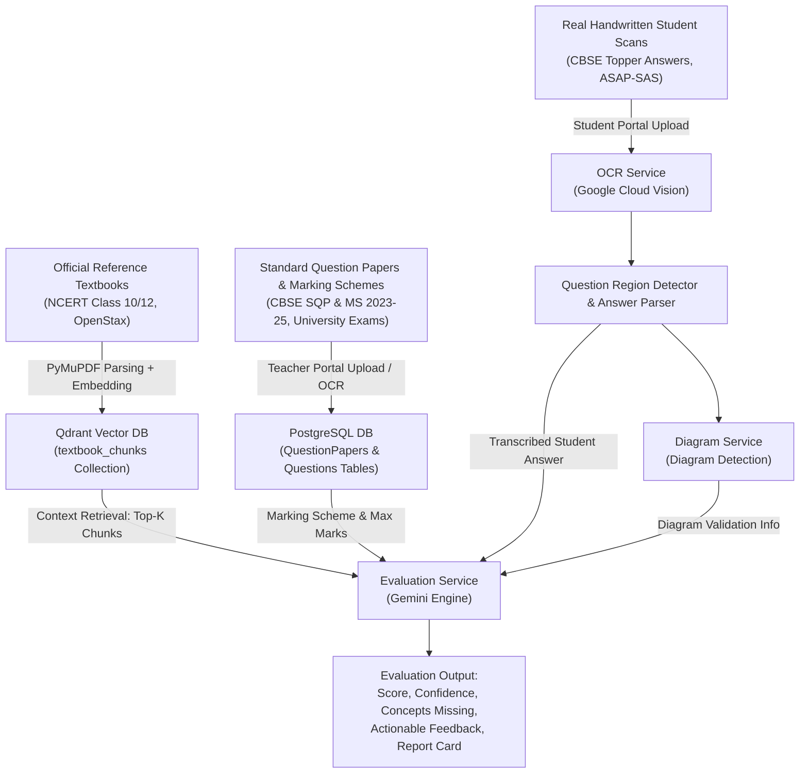

# Comprehensive Dataset & Resource Catalog for Automated Grading System Testing

This catalog collects direct links, official repository portals, downloadable PDFs, and open datasets specifically curated for end-to-end testing of the **Context-Aware Automated Grading System** (`project-k12`).

The resources are organized into three primary categories:
1. **Standardized Question Papers with Official Marking Schemes / Rubrics**
2. **Official Reference Textbooks for Qdrant RAG Ingestion**
3. **Real Handwritten Student Answer Sheets & Benchmark Datasets**

Each entry includes its **Direct URL**, **File Type**, **Subject / Domain**, and **Specific Test Utility** across OCR extraction, Qdrant RAG vector retrieval, and LLM evaluation.

---

## 1. Standardized Question Papers with Official Marking Schemes / Rubrics

Official marking schemes contain the step-by-step allocation of marks (e.g., 1/2 mark for formula, 1 mark for substitution, 1/2 mark for final answer with units). These serve as ground-truth rubrics for the system's `marking_scheme` parser and evaluator.

### 1.1 CBSE Class 10 (Academic Years 2023–24 & 2024–25)
*Official CBSE Academic Repository:* `https://cbseacademic.nic.in/sqp_classx_2023-24.html` & `https://cbseacademic.nic.in/sqp_classx_2024-25.html`

| Subject | Resource Type | Direct URL / Portal | File Type | Test Utility |
| :--- | :--- | :--- | :--- | :--- |
| **Science (086)** | Sample Question Paper (SQP) 2023-24 | [CBSE Class 10 Science SQP 2023-24](https://cbseacademic.nic.in/web_material/SQP/CLASS_X_2023_24/Science-SQP.pdf) | PDF | Test automated question paper parsing, section detection (Sec A: MCQs, Sec B: 2-mark, Sec C: 3-mark, Sec D: 5-mark, Sec E: Case study). |
| **Science (086)** | Marking Scheme (MS) 2023-24 | [CBSE Class 10 Science MS 2023-24](https://cbseacademic.nic.in/web_material/SQP/CLASS_X_2023_24/Science-MS.pdf) | PDF | Official rubric with precise value points, chemical equations, ray diagram mark distributions for Gemini LLM rubric evaluation. |
| **Science (086)** | Sample Question Paper 2024-25 | [CBSE Class 10 Science SQP 2024-25](https://cbseacademic.nic.in/web_material/SQP/ClassX_2024_25/Science-SQP.pdf) | PDF | Competency-focused questions; test question region detector and multi-subpart handling. |
| **Science (086)** | Marking Scheme 2024-25 | [CBSE Class 10 Science MS 2024-25](https://cbseacademic.nic.in/web_material/SQP/ClassX_2024_25/Science-MS.pdf) | PDF | Step-wise grading scheme with alternative acceptable answers and common misconceptions. |
| **Mathematics Standard (041)** | Sample Question Paper 2023-24 | [CBSE Class 10 Maths Standard SQP](https://cbseacademic.nic.in/web_material/SQP/CLASS_X_2023_24/MathsStandard-SQP.pdf) | PDF | Mathematical notation, LaTeX formula parsing, geometry proofs, and coordinate geometry questions. |
| **Mathematics Standard (041)** | Marking Scheme 2023-24 | [CBSE Class 10 Maths Standard MS](https://cbseacademic.nic.in/web_material/SQP/CLASS_X_2023_24/MathsStandard-MS.pdf) | PDF | Rigorous step-wise mark breakdown: step formulas (1 m), algebraic simplification (1 m), correct final unit (1 m). |
| **Mathematics Basic (241)** | Sample Question Paper 2023-24 | [CBSE Class 10 Maths Basic SQP](https://cbseacademic.nic.in/web_material/SQP/CLASS_X_2023_24/MathsBasic-SQP.pdf) | PDF | Direct application problems, arithmetic progressions, basic trigonometry. |
| **Mathematics Basic (241)** | Marking Scheme 2023-24 | [CBSE Class 10 Maths Basic MS](https://cbseacademic.nic.in/web_material/SQP/CLASS_X_2023_24/MathsBasic-MS.pdf) | PDF | Baseline rubric for partial mark scoring verification. |

---

### 1.2 CBSE Class 12 (Academic Years 2023–24 & 2024–25)
*Official CBSE Academic Repository:* `https://cbseacademic.nic.in/sqp_classxii_2023-24.html` & `https://cbseacademic.nic.in/sqp_classxii_2024-25.html`

| Subject | Resource Type | Direct URL / Portal | File Type | Test Utility |
| :--- | :--- | :--- | :--- | :--- |
| **Physics (042)** | Sample Question Paper 2023-24 | [CBSE Class 12 Physics SQP 2023-24](https://cbseacademic.nic.in/web_material/SQP/CLASS_XII_2023_24/Physics-SQP.pdf) | PDF | Complex multi-step derivations (Gauss law, Optics, Semiconductor devices) and circuit diagrams. |
| **Physics (042)** | Marking Scheme 2023-24 | [CBSE Class 12 Physics MS 2023-24](https://cbseacademic.nic.in/web_material/SQP/CLASS_XII_2023_24/Physics-MS.pdf) | PDF | Official step-marking guide: split marks for diagram (1 m), formula (1 m), substitution (1 m), calculation & unit (1 m). |
| **Chemistry (043)** | Sample Question Paper 2023-24 | [CBSE Class 12 Chemistry SQP 2023-24](https://cbseacademic.nic.in/web_material/SQP/CLASS_XII_2023_24/Chemistry-SQP.pdf) | PDF | Chemical reaction mechanisms, electrochemistry equations, IUPAC naming, coordination complexes. |
| **Chemistry (043)** | Marking Scheme 2023-24 | [CBSE Class 12 Chemistry MS 2023-24](https://cbseacademic.nic.in/web_material/SQP/CLASS_XII_2023_24/Chemistry-MS.pdf) | PDF | Rubric specifying required balanced equations, intermediate carbocation structures, and condition specifications. |
| **Biology (044)** | Sample Question Paper 2023-24 | [CBSE Class 12 Biology SQP 2023-24](https://cbseacademic.nic.in/web_material/SQP/CLASS_XII_2023_24/Biology-SQP.pdf) | PDF | Genetics Punnett squares, DNA replication pathways, ecological pyramids, labeled anatomical diagrams. |
| **Biology (044)** | Marking Scheme 2023-24 | [CBSE Class 12 Biology MS 2023-24](https://cbseacademic.nic.in/web_material/SQP/CLASS_XII_2023_24/Biology-MS.pdf) | PDF | Highly granular keyword-based scoring: tests Gemini evaluator's concept-matching and missing keyword penalties. |
| **Computer Science (083)** | Sample Question Paper 2023-24 | [CBSE Class 12 CS SQP 2023-24](https://cbseacademic.nic.in/web_material/SQP/CLASS_XII_2023_24/ComputerScience-SQP.pdf) | PDF | Python syntax questions, SQL queries, stack implementations, computer networking topologies. |
| **Computer Science (083)** | Marking Scheme 2023-24 | [CBSE Class 12 CS MS 2023-24](https://cbseacademic.nic.in/web_material/SQP/CLASS_XII_2023_24/ComputerScience-MS.pdf) | PDF | Code evaluation rubric: syntax correctness, logic flow, alternate valid SQL queries or Python idioms. |

---

### 1.3 University Engineering, Computer Science & Competitive Exams
*For testing the system's "Higher Education / University" and "General" evaluation pipeline.*

| Exam / Institution | Subject / Course | Direct URL / Portal | File Type | Test Utility |
| :--- | :--- | :--- | :--- | :--- |
| **GATE Official Portal** | Computer Science & IT (CS) 2024 | [GATE 2024 Official CS Master QP & Key](https://gate2024.iisc.ac.in/question-papers/) | PDF | Objective and numerical answer type (NAT) scoring with exact numerical ranges and multi-select questions. |
| **GATE Official Portal** | Electrical Engineering (EE) 2023/2024 | [GATE 2023/2024 Papers & Keys](https://gate2024.iisc.ac.in/question-papers/) | PDF | Circuit theory, signal processing questions for university-level numerical grading. |
| **MIT OpenCourseWare** | MIT 6.006: Introduction to Algorithms | [MIT OCW 6.006 Exams & Solutions](https://ocw.mit.edu/courses/6-006-introduction-to-algorithms-spring-2020/pages/exams/) | PDF & Web | Asymptotic runtime analysis ($O, \Omega, \Theta$), dynamic programming recurrences, graph algorithms with human grading rubrics. |
| **MIT OpenCourseWare** | MIT 6.042J: Mathematics for Computer Science | [MIT OCW 6.042J Exams & Solutions](https://ocw.mit.edu/courses/6-042j-mathematics-for-computer-science-spring-2015/pages/exams/) | PDF | Formal mathematical induction proofs, discrete math logic rubrics for proof validation. |
| **JEE Advanced Official** | Physics, Chemistry, Mathematics | [JEE Advanced Past Question Papers Archive](https://jeeadv.ac.in/archive.html) | PDF | High-rigor STEM problem evaluation, multi-step analytical reasoning, negative marking validation. |

---

## 2. Official Reference Textbooks (For Qdrant Vector DB Ingestion)

These textbooks represent the source-of-truth knowledge bases ingested into the Qdrant vector database via `textbook_ingestion_service.py` (chunked using `PyMuPDF` and embedded via `sentence-transformers`).

### 2.1 Official NCERT Textbooks (K12 Science & Mathematics)
*Official NCERT Portal:* `https://ncert.nic.in/textbook.php`
NCERT books can be retrieved either as complete subject ZIP archives or chapter-by-chapter PDFs using NCERT's standard URL pattern: `https://ncert.nic.in/textbook/pdf/{code}.pdf`.

| Subject & Grade | NCERT Book Code | Download URL (Complete Book / Chapters) | File Type | Test Utility in RAG Pipeline |
| :--- | :--- | :--- | :--- | :--- |
| **Class 10 Science** | `jesc1` | [Class 10 Science Complete ZIP (`jesc1dd.zip`)](https://ncert.nic.in/textbook/pdf/jesc1dd.zip)<br>Portal: `https://ncert.nic.in/textbook.php?jesc1=0-16` | ZIP / PDF | **Core K12 Benchmark**: Ingest all 16 chapters (Acids, Bases, Electricity, Light, Carbon Compounds). Test vector search against CBSE Class 10 Science exam queries. |
| **Class 10 Mathematics** | `jemh1` | [Class 10 Maths Complete ZIP (`jemh1dd.zip`)](https://ncert.nic.in/textbook/pdf/jemh1dd.zip)<br>Portal: `https://ncert.nic.in/textbook.php?jemh1=0-15` | ZIP / PDF | Test mathematical theorem retrieval, quadratic equation formulas, and geometric postulates. |
| **Class 12 Physics (Part 1)** | `leph1` | [Class 12 Physics I Complete ZIP (`leph1dd.zip`)](https://ncert.nic.in/textbook/pdf/leph1dd.zip)<br>Portal: `https://ncert.nic.in/textbook.php?leph1=0-8` | ZIP / PDF | Ingest electrostatics, magnetism, alternating current. Test chunk retrieval for derivation steps. |
| **Class 12 Physics (Part 2)** | `leph2` | [Class 12 Physics II Complete ZIP (`leph2dd.zip`)](https://ncert.nic.in/textbook/pdf/leph2dd.zip)<br>Portal: `https://ncert.nic.in/textbook.php?leph2=0-6` | ZIP / PDF | Wave optics, dual nature of radiation, semiconductors for diagram & concept retrieval. |
| **Class 12 Chemistry (Part 1)** | `lech1` | [Class 12 Chemistry I Complete ZIP (`lech1dd.zip`)](https://ncert.nic.in/textbook/pdf/lech1dd.zip)<br>Portal: `https://ncert.nic.in/textbook.php?lech1=0-5` | ZIP / PDF | Ingest physical and inorganic chemistry (Solutions, Electrochemistry, Kinetics, d-block). |
| **Class 12 Chemistry (Part 2)** | `lech2` | [Class 12 Chemistry II Complete ZIP (`lech2dd.zip`)](https://ncert.nic.in/textbook/pdf/lech2dd.zip)<br>Portal: `https://ncert.nic.in/textbook.php?lech2=0-5` | ZIP / PDF | Organic chemistry named reactions (Aldehydes, Ketones, Amines, Biomolecules). |
| **Class 12 Biology** | `lebo1` | [Class 12 Biology Complete ZIP (`lebo1dd.zip`)](https://ncert.nic.in/textbook/pdf/lebo1dd.zip)<br>Portal: `https://ncert.nic.in/textbook.php?lebo1=0-16` | ZIP / PDF | Genetics, Biotechnology, Human Health. Ideal for dense descriptive paragraph retrieval. |
| **Class 12 Computer Science** | `lecs1` | [Class 12 CS Complete ZIP (`lecs1dd.zip`)](https://ncert.nic.in/textbook/pdf/lecs1dd.zip)<br>Portal: `https://ncert.nic.in/textbook.php?lecs1=0-13` | ZIP / PDF | Python programming, Data Structures, Computer Networks. Test code-block retrieval in vector store. |

---

### 2.2 OpenStax Open-Access Textbooks (Higher Education & Advanced STEM)
*OpenStax texts are peer-reviewed, open-licensed (CC-BY 4.0), and offer direct high-speed PDF downloads without captchas or IP rate limits.*

| Book Title | Subject / Level | Direct Access / PDF Portal | License / Format | Test Utility |
| :--- | :--- | :--- | :--- | :--- |
| **University Physics (Vols 1, 2, 3)** | University Calculus-based Physics | [OpenStax University Physics Vol 1](https://openstax.org/details/books/university-physics-volume-1)<br>[OpenStax University Physics Vol 2](https://openstax.org/details/books/university-physics-volume-2) | CC-BY 4.0 / PDF | Test vector chunking on large textbook volumes (800+ pages), dense vector search, and formula extraction. |
| **College Physics 2e** | High School / College Physics | [OpenStax College Physics](https://openstax.org/details/books/college-physics-2e) | CC-BY 4.0 / PDF | Ingest algebra-based physics concepts; tests similarity score thresholds in Qdrant. |
| **Chemistry 2e** | General Chemistry | [OpenStax Chemistry 2e](https://openstax.org/details/books/chemistry-2e) | CC-BY 4.0 / PDF | Chemical stoichiometry, thermodynamic tables, atomic structure RAG retrieval. |
| **Biology 2e** | General Biology | [OpenStax Biology 2e](https://openstax.org/details/books/biology-2e) | CC-BY 4.0 / PDF | Comprehensive chapters on cell biology, molecular genetics, physiology. |
| **Calculus (Vols 1, 2, 3)** | University Mathematics | [OpenStax Calculus Volume 1](https://openstax.org/details/books/calculus-volume-1) | CC-BY 4.0 / PDF | Differentiation, integration rules, series expansions for grading university math assignments. |

---

### 2.3 Open Computer Science Textbooks
*Standard university-level computer science texts available freely online.*

| Book Title | Author(s) | Direct Access / Repository | Format | Test Utility |
| :--- | :--- | :--- | :--- | :--- |
| **Operating Systems: Three Easy Pieces (OSTEP)** | Remzi & Andrea Arpaci-Dusseau (Univ. of Wisconsin) | [OSTEP Free Online Chapters](https://pages.cs.wisc.edu/~remzi/OSTEP/) | Chapter PDFs | Virtualization, Concurrency, Persistence. Test university CS operating systems evaluation. |
| **Computer Networks: A Systems Approach** | Larry Peterson & Bruce Davie | [Systems Approach Online Book](https://book.systemsapproach.org/) | HTML / Markdown / PDF | Protocol hierarchies, TCP/IP, congestion control. Test Qdrant markdown/text ingestion. |
| **OpenDSA (Data Structures & Algorithms)** | OpenDSA Project (Virginia Tech) | [OpenDSA Server & E-textbook](https://opendsa-server.cs.vt.edu/) | Web / Open Textbook | Trees, sorting algorithms, algorithmic complexity for automated code/logic grading. |

---

## 3. Real Handwritten Student Answer Sheets & Benchmark Datasets

Evaluating handwritten student papers requires testing against diverse handwriting styles, messy pencil/ink scripts, strikethroughs, marginal notes, diagram sketches, and varied photo upload angles.

### 3.1 CBSE Official "Model Answers by Candidates" (Topper Answer Books)
CBSE officially releases authentic scanned photocopies of the highest-scoring candidate answer books ("Model Answers by Candidates") along with the original question papers.
*Official CBSE Portal Archive:* `https://www.cbse.gov.in/cbsenew/model-answer.html`

| Exam & Subject | Exam Year | Official Portal / Direct PDF Resource | Handwriting Characteristics | Pipeline Test Focus |
| :--- | :--- | :--- | :--- | :--- |
| **CBSE Class 10 Science** | 2023 | [CBSE Model Answers Portal](https://www.cbse.gov.in/cbsenew/model-answer.html) *(Under Class X -> Science)* | Real cursive student handwriting, hand-drawn ray diagrams, chemical equations, margin question numbers (`Q.12`, `Ans:`). | **Full E2E Testing**: Upload scanned pages to `/api/student/submit/{paper_id}`. Verify Google Cloud Vision OCR extraction, question segmenter, diagram detection, and Gemini scoring. |
| **CBSE Class 10 Mathematics** | 2023 | [CBSE Model Answers Portal](https://www.cbse.gov.in/cbsenew/model-answer.html) *(Under Class X -> Mathematics)* | Multi-step algebraic solutions, geometric constructions (circles, triangles), step-by-step arithmetic. | Test OCR on mathematical fractions, square roots, variable subscripts, and step-wise grading. |
| **CBSE Class 12 Physics** | 2022 / 2023 | [CBSE Model Answers Portal](https://www.cbse.gov.in/cbsenew/model-answer.html) *(Under Class XII -> Physics)* | Hand-sketched circuit diagrams, electric field lines, derivations with cross-outs and margin corrections. | Test `diagram_service.py` (detecting whether a required diagram was drawn and properly labeled) + confidence leniency overrides. |
| **CBSE Class 12 Chemistry** | 2022 / 2023 | [CBSE Model Answers Portal](https://www.cbse.gov.in/cbsenew/model-answer.html) *(Under Class XII -> Chemistry)* | Handwritten structural formulas (benzene rings, aldehyde functional groups), thermodynamic state calculations. | Test chemical entity extraction and reaction completion grading against textbook context. |
| **CBSE Class 12 Biology** | 2022 / 2023 | [CBSE Model Answers Portal](https://www.cbse.gov.in/cbsenew/model-answer.html) *(Under Class XII -> Biology)* | Extensive handwritten long-form descriptive paragraphs, labeled biological sketches (flower anatomy, nephron). | Test chunk retrieval semantic alignment and missing concept detection (e.g. feedback on missing keywords). |
| **CBSE Historical Topper Scans** | 2019 / 2020 | [CBSE 2019/2020 Model Answers Archive](https://www.cbse.gov.in/cbsenew/model-answer.html) | High variance in scanning resolution, faint blue ink, slight rotations, examiner red-pen annotations. | Stress-test OCR preprocessing (deskewing, contrast normalization, ignoring red examiner marks). |

---

### 3.2 Automated Student Assessment Benchmarks (ASAP & Kaggle)
Standard public datasets used in educational NLP research to benchmark automated short-answer scoring and essay grading.

| Dataset Name | Source / Organization | Access Link | Dataset Content & Metrics | Pipeline Test Focus |
| :--- | :--- | :--- | :--- | :--- |
| **ASAP-SAS (Short Answer Scoring)** | Kaggle / The Hewlett Foundation | [Kaggle ASAP Short Answer Scoring](https://www.kaggle.com/c/asap-sas/data) | **17,000+ student responses across 10 prompts** in Science, Biology, and English. Each response is double-graded by human experts (scores 0–3 or 0–4). Includes detailed prompt rubrics. | **Gold-Standard LLM Benchmarking**: Run responses through `evaluation_service.py` to calculate Quadratic Weighted Kappa (QWK) and correlation against human expert scores. |
| **ASAP-AES (Automated Essay Scoring)** | Kaggle / The Hewlett Foundation | [Kaggle ASAP Automated Essay Scoring](https://www.kaggle.com/c/asap-aes/data) | **13,000+ full-length student essays across 8 prompts**. Includes prompt rubrics and holistic human scores. | Test long-form evaluation, grammar and coherence scoring, and feedback quality. |
| **SciEntsBank & Beetle Datasets** | SemEval / University of North Texas | [SemEval Student Response Analysis](https://www.cs.york.ac.uk/semeval-2013/task7/) | 10,000+ short scientific explanations (3rd–6th and middle school science) categorized as *Correct*, *Partially Correct*, *Contradictory*, *Irrelevant*. | Benchmark semantic similarity, hallucination avoidance, and misconceptions identification. |

---

### 3.3 Open Handwritten Text Recognition & Math Datasets

| Dataset Name | Organization / Source | Direct URL / Repository | Data Type | Test Utility |
| :--- | :--- | :--- | :--- | :--- |
| **CROHME (Handwritten Math Expressions)** | ICFHR / Kaggle Archive | [CROHME Math Dataset](https://www.isical.ac.in/~crohme/)<br>[Kaggle CROHME Mirror](https://www.kaggle.com/datasets/sagyamthapa/crohme-2019) | Scanned handwritten mathematical equations with LaTeX and MathML ground truths. | Test LaTeX extraction accuracy for math formulas in student answer sheets. |
| **IAM Handwriting Database** | FKI Research Group (Univ. of Bern) | [IAM Database Portal](https://fki.tic.heia-fr.ch/databases/iam-handwriting-database) | 1,539 pages of scanned handwritten text from 657 writers (unconstrained handwriting). | Establish baseline Character Error Rate (CER) and Word Error Rate (WER) for the OCR pipeline. |
| **Zenodo / OpenML Exam Scans** | Mendeley Data / Zenodo | [Zenodo Scientific Exam Papers](https://zenodo.org/) *(Search: `handwritten exam scripts`)* | Real multi-page university exam booklets with student answers, scribbles, and sketches. | Test multi-page stitched PDF uploads and question segmentation across page breaks. |

---

## 4. End-to-End Testing Matrix across System Components



---

## 5. Quick-Start Download Script (Curl Commands)

To quickly pull sample test files onto the local test folder:

```bash
# Create test data directories
mkdir -p test_assets/question_papers test_assets/textbooks test_assets/student_answers

# 1. Download CBSE Class 10 Science Sample Question Paper & Marking Scheme (2023-24)
curl -o test_assets/question_papers/CBSE_Class10_Science_SQP_2023.pdf \
  "https://cbseacademic.nic.in/web_material/SQP/CLASS_X_2023_24/Science-SQP.pdf"

curl -o test_assets/question_papers/CBSE_Class10_Science_MS_2023.pdf \
  "https://cbseacademic.nic.in/web_material/SQP/CLASS_X_2023_24/Science-MS.pdf"

# 2. Download CBSE Class 12 Physics Sample Question Paper & Marking Scheme (2023-24)
curl -o test_assets/question_papers/CBSE_Class12_Physics_SQP_2023.pdf \
  "https://cbseacademic.nic.in/web_material/SQP/CLASS_XII_2023_24/Physics-SQP.pdf"

curl -o test_assets/question_papers/CBSE_Class12_Physics_MS_2023.pdf \
  "https://cbseacademic.nic.in/web_material/SQP/CLASS_XII_2023_24/Physics-MS.pdf"

# 3. Download NCERT Class 10 Science Complete Textbook ZIP (for Qdrant ingestion)
curl -o test_assets/textbooks/NCERT_Class10_Science.zip \
  "https://ncert.nic.in/textbook/pdf/jesc1dd.zip"

# 4. Download NCERT Class 10 Maths Complete Textbook ZIP
curl -o test_assets/textbooks/NCERT_Class10_Maths.zip \
  "https://ncert.nic.in/textbook/pdf/jemh1dd.zip"
```
